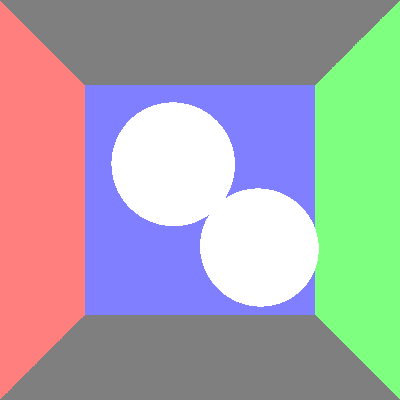

# COMP30019 Assignment 1 - Ray Tracer

## Completed stages

##### Stage 1

- [x] Stage 1.1 - Familiarise yourself with the template
- [x] Stage 1.2 - Implement vector mathematics
- [x] Stage 1.3 - Fire a ray for each pixel
- [x] Stage 1.4 - Calculate ray-entity intersections
- [x] Stage 1.5 - Output primitives as solid colours

##### Stage 2

- [x] Stage 2.1 - Diffuse materials
- [x] Stage 2.2 - Shadow rays
- [x] Stage 2.3 - Reflective materials
- [x] Stage 2.4 - Refractive materials
- [x] Stage 2.5 - The Fresnel effect
- [x] Stage 2.6 - Anti-aliasing

##### Stage 3

- [ ] Option A - Emissive materials (+6)
- [ ] Option B - Ambient lighting/occlusion (+6)
- [ ] Option C - OBJ models (+6)
- [x] Option D - Glossy materials (+3)
- [x] Option E - Custom camera orientation (+3)
- [x] Option F - Beer's law (+3)
- [ ] Option G - Depth of field (+3)


**Approaches to Stage 3**

**Option D** - Glossy materials: Color = 0.3 * Ave(ReflectColors) + 0.7 * DiffuseColor \
Fire 4 more rays from the hit position with different reflection angles (within 12 degrees) and calculate the average.

**Option E** - Custom camera orientation \
Pos: Set the camera position as the origrin of rays from camera. Add corresponding offsets to coordinates when computing direction of camera rays. \
Axis: Scale CameraAxis and compute the difference between it and default axis. Plus the difference to the computed ray direction will give the rotated direction. \
Angle: Set the CameraAngle as the fov when computing direction.

**Option F** - Beer's law: Absorb index of color = exp(-absorbance * absorbDistance) \
The color of refractive material is the absorbance of each color channel. The distance between refraction origin and hit point is calucated. Finally, multiply the original computed color by the absorb index to get the result.


## Final scene render


This render took **5** minutes and **50** seconds on my PC.

I used the following command to render the image exactly as shown:

```
dotnet run -- -f tests/final_scene.txt -o output.png -x 4
```

**Note:** This scene has two mirrors (rear & far), which is a dual mirror system. There is a light source on each wall with different colors. RightSphere and LeftSpere are both glass but with different absorbance. The ball on the roof is a mirror sphere. There is also a glossy triangle above the floor. For sample scene, the max depth is set to 10. In this scene, the **max depth** is set to **50** because it is largely based on reflection.

## Sample outputs

###### Sample 1
```
dotnet run -- -f tests/sample_scene_1.txt -o images/sample_scene_1.png -x 4
```
<p float="left">
  
   
</p>

###### Sample 2

```
dotnet run -- -f tests/sample_scene_2.txt -o images/sample_scene_2.png -x 4
```
<p float="left">
  
   
</p>

## References

Working through a ray tracer, from the head of the xbox games studio: https://www.linkedin.com/pulse/writing-simple-ray-tracer-c-matt-booty/

*Ray Tracing in a Weekend*: https://raytracing.github.io/

Great walkthrough of some of the basic maths: https://blog.scottlogic.com/2020/03/10/raytracer-how-to.html

Scratchapixel: intro to ray tracing: https://www.scratchapixel.com/lessons/3d-basic-rendering/introduction-to-ray-tracing/how-does-it-work

Lecture Slides: Raytracing

Cross product: https://en.wikipedia.org/wiki/Cross_product

Intersection: \
https://www.scratchapixel.com/lessons/3d-basic-rendering/ray-tracing-rendering-a-triangle/ray-triangle-intersection-geometric-solution \
https://github.com/idris/raytracer/tree/master/src/raytracer/shapes

Shadow: https://github.com/idris/raytracer/blob/master/src/raytracer/RayTracer.java

Reflection, Refraction, Fresnel, Beer's Law: \
https://github.com/idris/raytracer/blob/master/src/raytracer/RayHit.java \
https://www.scratchapixel.com/lessons/3d-basic-rendering/introduction-to-shading/reflection-refraction-fresnel \
https://blog.demofox.org/2017/01/09/raytracing-reflection-refraction-fresnel-total-internal-reflection-and-beers-law

Glossy: http://www.cs.cmu.edu/afs/cs/academic/class/15462-s09/www/lec/13/lec13.pdf \

## Grading Report
**Final Grade:** 20.0  
**Additional Comments:** -  
   
7:59:57 PM: Building project C:\Users\Alex\Documents\GitHub\Project-1-Auto-Test\projects\LOOP115  
7:59:58 PM: STDOUT: 

Microsoft (R) Build Engine version 16.10.2+857e5a733 for .NET
Copyright (C) Microsoft Corporation. All rights reserved.

  Determining projects to restore...
  Restored C:\Users\Alex\Documents\GitHub\Project-1-Auto-Test\projects\LOOP115\RayTracer.csproj (in 131 ms).
  RayTracer -> C:\Users\Alex\Documents\GitHub\Project-1-Auto-Test\projects\LOOP115\report\bin\RayTracer.dll

Build succeeded.
    0 Warning(s)
    0 Error(s)

Time Elapsed 00:00:01.06  
7:59:58 PM: Success building project.  
### Stage 1
7:59:58 PM: Running test: 1_1_camera @ tests\Stage_1\1_1_camera~30s~-w_400_-h_300.txt  
7:59:58 PM: Iteration timeout: 30 seconds  
7:59:58 PM: Additional args: -w 400 -h 300  
7:59:59 PM: STDOUT: 

Render Time: 147 ms  
7:59:59 PM: Render completed in **0.3 seconds** user processor time (raw = 0.3s).  

<p float="left">


</p>

7:59:59 PM: Running test: 1_2_primitives @ tests\Stage_1\1_2_primitives~30s.txt  
7:59:59 PM: Iteration timeout: 30 seconds  
7:59:59 PM: Additional args: none  
7:59:59 PM: STDOUT: 

Render Time: 279 ms  
7:59:59 PM: Render completed in **0.45 seconds** user processor time (raw = 0.45s).  

<p float="left">


</p>

7:59:59 PM: Running test: 1_3_depth @ tests\Stage_1\1_3_depth~30s.txt  
7:59:59 PM: Iteration timeout: 30 seconds  
7:59:59 PM: Additional args: none  
8:00:00 PM: STDOUT: 

Render Time: 344 ms  
8:00:00 PM: Render completed in **0.48 seconds** user processor time (raw = 0.48s).  

<p float="left">


</p>

### Stage 1 Rubric
---
- [x] Stage Attempted (+12 marks)
---
- [x] Camera - FOV Incorrect (-1 marks)
- [ ] Camera - Aspect Ratio Incorrect (-1 marks)
- [ ] Camera - Other Issue (minor) (-0.5 marks)
- [ ] Camera - Other Issue (major) (-1 marks)
---
- [ ] Shape - Plane Incorrect (-1 marks)
- [ ] Shape - Triangle Incorrect (-1 marks)
- [ ] Shape - Sphere Incorrect (-1 marks)
- [ ] Shape - Other Issue (minor) (-0.5 marks)
- [ ] Shape - Other Issue (major) (-1 marks)
---
- [ ] Depth - Wrong Order (1 case) (-1 marks)
- [ ] Depth - Wrong Order (2+ cases) (-2 marks)
- [ ] Depth - Other Issue (minor) (-0.5 marks)
- [ ] Depth - Other Issue (major) (-1 marks)
---
- [ ] Colour - Wrong Colour (1 case) (-1 marks)
- [ ] Colour - Wrong Colour (2+ cases) (-2 marks)
- [ ] Colour - Other Issue (minor) (-0.5 marks)
- [ ] Colour - Other Issue (major) (-1 marks)
---
- [ ] Other Issue #1 (major) (-1 marks)
- [ ] Other Issue #2 (major) (-1 marks)
- [ ] Other Issue #3 (minor) (-0.5 marks)
- [ ] Other Issue #4 (minor) (-0.5 marks)
---
**Additional Comments:** -  
  
---

  
### Stage 2
8:00:00 PM: Running test: 2_1_diffuse @ tests\Stage_2\2_1_diffuse~60s.txt  
8:00:00 PM: Iteration timeout: 60 seconds  
8:00:00 PM: Additional args: none  
8:00:01 PM: STDOUT: 

Render Time: 443 ms  
8:00:01 PM: Render completed in **0.66 seconds** user processor time (raw = 0.66s).  

<p float="left">


</p>

8:00:01 PM: Running test: 2_2_reflection @ tests\Stage_2\2_2_reflection~60s.txt  
8:00:01 PM: Iteration timeout: 60 seconds  
8:00:01 PM: Additional args: none  
8:00:01 PM: STDOUT: 

Render Time: 317 ms  
8:00:01 PM: Render completed in **0.44 seconds** user processor time (raw = 0.44s).  

<p float="left">


</p>

8:00:01 PM: Running test: 2_3_refraction @ tests\Stage_2\2_3_refraction~300s.txt  
8:00:01 PM: Iteration timeout: 300 seconds  
8:00:01 PM: Additional args: none  
8:00:38 PM: STDOUT: 

Render Time: 36344 ms  
8:00:38 PM: Render completed in **36.48 seconds** user processor time (raw = 36.48s).  

<p float="left">


</p>

8:00:38 PM: Running test: 2_4_sample @ tests\Stage_2\2_4_sample~300s~-x_3.txt  
8:00:38 PM: Iteration timeout: 300 seconds  
8:00:38 PM: Additional args: -x 3  
8:00:53 PM: STDOUT: 

Render Time: 14677 ms  
8:00:53 PM: Render completed in **14.81 seconds** user processor time (raw = 14.81s).  

<p float="left">


</p>

### Stage 2 Rubric
---
- [x] Stage Attempted (+9 marks)
---
- [ ] Diffuse Light - No Output (-1 marks)
- [ ] Diffuse Light - Incorrect Equation/Normals (-1 marks)
- [ ] Diffuse Light - Other Issue (major) (-1 marks)
- [ ] Diffuse Light - Other Issue (minor) (-0.5 marks)
---
- [ ] Shadows - No Output (-1 marks)
- [ ] Shadows - Multiple Light Issues (-0.5 marks)
- [ ] Shadows - Other Issue (major) (-1 marks)
- [ ] Shadows - Other Issue (minor) (-0.5 marks)
---
- [ ] Reflection - No Output (-2 marks)
- [ ] Reflection - Partial Output (-1 marks)
- [ ] Reflection - Reflecting Refraction Issue (major) (-1 marks)
- [ ] Reflection - Reflecting Refraction Issue (minor) (-0.5 marks)
- [ ] Reflection - Other Issue (major) (-1 marks)
- [ ] Reflection - Other Issue (minor) (-0.5 marks)
---
- [ ] Refraction - No Output (-2 marks)
- [x] Refraction - Partial Output (-1 marks)
- [ ] Refraction - Recursivity Issue(s) (-0.5 marks)
- [ ] Refraction - Non-Sphere Issue(s) (-0.5 marks)
- [x] Refraction - Other Issue (major) (-1 marks)
- [ ] Refraction - Other Issue (minor) (-0.5 marks)
---
- [ ] Fresnel - No Output (-2 marks)
- [ ] Fresnel - Angle of Incidence Issue (-1 marks)
- [ ] Fresnel - Minor Artefact (-0.5 marks)
- [ ] Fresnel - Major Artefact (-1 marks)
---
- [ ] Anti-aliasing - No Output (-1 marks)
- [ ] Anti-aliasing - Minor Artefact (-0.5 marks)
- [ ] Anti-aliasing - Major Artefact (-1 marks)
---
- [ ] Other Issue #1 (major) (-1 marks)
- [ ] Other Issue #2 (major) (-1 marks)
- [ ] Other Issue #3 (minor) (-0.5 marks)
- [ ] Other Issue #4 (minor) (-0.5 marks)
---
**Additional Comments:** -  
  
---

  
### Stage 3A
8:00:53 PM: Running test: 3A_1_baseline @ tests\Stage_3A\3A_1_baseline~60s.txt  
8:00:53 PM: Iteration timeout: 60 seconds  
8:00:53 PM: Additional args: none  
8:00:53 PM: STDOUT: 

Render Time: 285 ms  
8:00:53 PM: Render completed in **0.44 seconds** user processor time (raw = 0.44s).  

<p float="left">


</p>

8:00:53 PM: Running test: 3A_2_emissive_low @ tests\Stage_3A\3A_2_emissive_low~1800s.txt  
8:00:53 PM: Iteration timeout: 1800 seconds  
8:00:53 PM: Additional args: none  
8:00:54 PM: STDOUT: 

Render Time: 191 ms  
8:00:54 PM: Render completed in **0.36 seconds** user processor time (raw = 0.36s).  

<p float="left">


</p>

8:00:54 PM: Running test: 3A_3_emissive_med @ tests\Stage_3A\3A_3_emissive_med~1800s.txt  
8:00:54 PM: Iteration timeout: 1800 seconds  
8:00:54 PM: Additional args: none  
8:00:54 PM: STDOUT: 

Render Time: 222 ms  
8:00:54 PM: Render completed in **0.38 seconds** user processor time (raw = 0.38s).  

<p float="left">


</p>

8:00:54 PM: Running test: 3A_4_emissive_high @ tests\Stage_3A\3A_4_emissive_high~1800s.txt  
8:00:54 PM: Iteration timeout: 1800 seconds  
8:00:54 PM: Additional args: none  
8:00:54 PM: STDOUT: 

Render Time: 186 ms  
8:00:54 PM: Render completed in **0.34 seconds** user processor time (raw = 0.34s).  

<p float="left">


</p>

### Stage 3A Rubric
---
- [ ] Stage Attempted (+6 marks)
---
- [ ] Source - Invisible (-1 marks)
- [ ] Source - Emission Colour Incorrect (-1 marks)
- [ ] Source - Material Colour Incorrect (-1 marks)
- [ ] Source - Material Receives Illumination (-1 marks)
- [ ] Source - Other Issue (major) (-1 marks)
- [ ] Source - Other Issue (minor) (-0.5 marks)
---
- [ ] Soft Shadows - Not Present (all cases) (-5 marks)
- [ ] Soft Shadows - Not Present (one+ case) (-2 marks)
- [ ] Soft Shadows - Major Issue (-2 marks)
- [ ] Soft Shadows - Minor Issue (-1 marks)
---
- [ ] Noise - Incomprehensible Image (-6 marks)
- [ ] Noise - Not Justified (-2 marks)
- [ ] Noise - Partially Justified (-1 marks)
---
- [ ] Time - Complete Timeout (-6 marks)
- [ ] Time - Not Justified (-2 marks)
- [ ] Time - Partially Justified (-1 marks)
---
- [ ] Other Issue #1 (major) (-1 marks)
- [ ] Other Issue #2 (major) (-1 marks)
- [ ] Other Issue #3 (minor) (-0.5 marks)
- [ ] Other Issue #4 (minor) (-0.5 marks)
---
**Additional Comments:** -  
  
---

  
### Stage 3B
8:00:54 PM: Running test: 3B_1_ambient @ tests\Stage_3B\3B_1_ambient~3600s~-l.txt  
8:00:54 PM: Iteration timeout: 3600 seconds  
8:00:54 PM: Additional args: -l  
8:00:55 PM: STDOUT: 

Render Time: 277 ms  
8:00:55 PM: Render completed in **0.44 seconds** user processor time (raw = 0.44s).  

<p float="left">


</p>

### Stage 3B Rubric
---
- [ ] Stage Attempted (+6 marks)
---
- [ ] Indirect Light - None (-6 marks)
- [ ] Indirect Light - Partial or Unrealistic (-3 marks)
- [ ] Indirect Light - Incorrect Colour(s) (-2 marks)
- [ ] Indirect Light - Other Issue (major) (-1 marks)
- [ ] Indirect Light - Other Issue (minor) (-0.5 marks)
---
- [ ] Noise - Incomprehensible Image (-6 marks)
- [ ] Noise - Not Justified (-2 marks)
- [ ] Noise - Partially Justified (-1 marks)
---
- [ ] Time - Complete Timeout (-6 marks)
- [ ] Time - Not Justified (-2 marks)
- [ ] Time - Partially Justified (-1 marks)
---
- [ ] Other Issue #1 (major) (-1 marks)
- [ ] Other Issue #2 (major) (-1 marks)
- [ ] Other Issue #3 (minor) (-0.5 marks)
- [ ] Other Issue #4 (minor) (-0.5 marks)
---
**Additional Comments:** -  
  
---

  
### Stage 3C
8:00:55 PM: Running test: 3C_1_baseline @ tests\Stage_3C\3C_1_baseline~1200s.txt  
8:00:55 PM: Iteration timeout: 1200 seconds  
8:00:55 PM: Additional args: none  
8:00:56 PM: STDOUT: 

Render Time: 1061 ms  
8:00:56 PM: Render completed in **1.2 seconds** user processor time (raw = 1.2s).  

<p float="left">


</p>

8:00:56 PM: Running test: 3C_2_obj @ tests\Stage_3C\3C_2_obj~1200s.txt  
8:00:56 PM: Iteration timeout: 1200 seconds  
8:00:56 PM: Additional args: none  
8:00:57 PM: STDOUT: 

Render Time: 1161 ms  
8:00:57 PM: Render completed in **1.31 seconds** user processor time (raw = 1.31s).  

<p float="left">


</p>

8:00:57 PM: Running test: 3C_3_obj @ tests\Stage_3C\3C_3_obj~1200s.txt  
8:00:57 PM: Iteration timeout: 1200 seconds  
8:00:57 PM: Additional args: none  
8:00:58 PM: STDOUT: 

Render Time: 701 ms  
8:00:58 PM: Render completed in **0.84 seconds** user processor time (raw = 0.84s).  

<p float="left">


</p>

### Stage 3C Rubric
---
- [ ] Stage Attempted (+6 marks)
---
- [ ] Shape - Not Visible (-6 marks)
- [ ] Shape - Major Artefact(s) (-2 marks)
- [ ] Shape - Minor Artefact(s) (-1 marks)
- [ ] Shape - RH Coordinate System (-0.5 marks)
---
- [ ] Lighting - Incorrect Normals (-2 marks)
- [ ] Lighting - Unsmoothed Normals (-1 marks)
- [ ] Lighting - Material Issue(s) (-1 marks)
- [ ] Lighting - Other Issue (minor) (-0.5 marks)
- [ ] Lighting - Other Issue (major) (-1 marks)
---
- [ ] Reflection - Major Artefact(s) (-2 marks)
- [ ] Reflection - Minor Artefact(s) (-1 marks)
- [ ] Reflection - Other Issue (minor) (-0.5 marks)
- [ ] Reflection - Other Issue (major) (-1 marks)
---
- [ ] Time - Bunny >5x Sphere (-0.5 marks)
- [ ] Time - Bunny >10x Sphere (-1 marks)
- [ ] Time - Bunny >25x Sphere (-2 marks)
- [ ] Time - Bunny >100x Sphere (or downscale) (-3 marks)
- [ ] Time - Complete Timeout (-6 marks)
---
- [ ] Other Issue #1 (major) (-1 marks)
- [ ] Other Issue #2 (major) (-1 marks)
- [ ] Other Issue #3 (minor) (-0.5 marks)
- [ ] Other Issue #4 (minor) (-0.5 marks)
---
**Additional Comments:** -  
  
---

  
### Stage 3D
8:00:58 PM: Running test: 3D_1_glossy @ tests\Stage_3D\3D_1_glossy~1800s.txt  
8:00:58 PM: Iteration timeout: 1800 seconds  
8:00:58 PM: Additional args: none  
8:30:58 PM: Test timed out (1800 seconds)  
8:30:58 PM: Update args (downscale):  -w 200 -h 200  
8:30:58 PM: Test re-attempt...  
8:57:33 PM: STDOUT: 

Render Time: 1595957 ms  
8:57:33 PM: Render completed in **25 minutes, 49 seconds** user processor time (raw = 1549.67s).  

<p float="left">


</p>

### Stage 3D Rubric
---
- [x] Stage Attempted (+3 marks)
---
- [ ] Effect - Not Visible (-3 marks)
- [ ] Effect - Unconvincing (-2 marks)
- [x] Effect - Partially convincing (-1 marks)
- [ ] Effect - Minor Issue/Artefact(s) (-0.5 marks)
---
- [ ] Technique - Overly Simple (-1 marks)
- [ ] Technique - Minor Issue (-0.5 marks)
- [ ] Technique - Major Issue (-1 marks)
---
- [ ] Time - Complete Timeout (-3 marks)
- [x] Time - Not Justified (-2 marks)
- [ ] Time - Partially Justified (-1 marks)
---
- [ ] Other Issue #1 (major) (-1 marks)
- [ ] Other Issue #2 (major) (-1 marks)
- [ ] Other Issue #3 (minor) (-0.5 marks)
- [ ] Other Issue #4 (minor) (-0.5 marks)
---
**Additional Comments:** -  
  
---

  
### Stage 3E
8:57:33 PM: Running test: 3E_1_camera @ tests\Stage_3E\3E_1_camera~30s~--cam-pos_0,2,-0.5_--cam-axis_1,0,0_--cam-angle_45.txt  
8:57:33 PM: Iteration timeout: 30 seconds  
8:57:33 PM: Additional args: --cam-pos 0,2,-0.5 --cam-axis 1,0,0 --cam-angle 45  
8:57:34 PM: STDOUT: 

Render Time: 109 ms  
8:57:34 PM: Render completed in **0.19 seconds** user processor time (raw = 0.19s).  

<p float="left">


</p>

8:57:34 PM: Running test: 3E_2_camera @ tests\Stage_3E\3E_2_camera~30s~--cam-pos_0,2,-0.5_--cam-axis_1,0,0_--cam-angle_-45.txt  
8:57:34 PM: Iteration timeout: 30 seconds  
8:57:34 PM: Additional args: --cam-pos 0,2,-0.5 --cam-axis 1,0,0 --cam-angle -45  
8:57:34 PM: STDOUT: 

Render Time: 109 ms  
8:57:34 PM: Render completed in **0.22 seconds** user processor time (raw = 0.22s).  

<p float="left">


</p>

8:57:34 PM: Running test: 3E_3_camera @ tests\Stage_3E\3E_3_camera~30s~--cam-pos_0,0,-1_--cam-axis_0,0.707,0.707_--cam-angle_20.txt  
8:57:34 PM: Iteration timeout: 30 seconds  
8:57:34 PM: Additional args: --cam-pos 0,0,-1 --cam-axis 0,0.707,0.707 --cam-angle 20  
8:57:34 PM: STDOUT: 

Render Time: 105 ms  
8:57:34 PM: Render completed in **0.2 seconds** user processor time (raw = 0.2s).  

<p float="left">


</p>

### Stage 3E Rubric
---
- [ ] Stage Attempted (+3 marks)
---
- [ ] Position - Incorrect (1 case) (-1 marks)
- [ ] Position - Incorrect (2+ cases) (-2 marks)
---
- [ ] Rotation - Wrong Angle (-1 marks)
- [ ] Rotation - Wrong Angle Direction (-1 marks)
- [ ] Rotation - Incorrect (1 case) (-1 marks)
- [ ] Rotation - Incorrect (2+ cases) (-2 marks)
---
- [ ] Time - Complete Timeout (-3 marks)
- [ ] Time - Not Justified (-2 marks)
- [ ] Time - Partially Justified (-1 marks)
---
- [ ] Other Issue #1 (major) (-1 marks)
- [ ] Other Issue #2 (major) (-1 marks)
- [ ] Other Issue #3 (minor) (-0.5 marks)
- [ ] Other Issue #4 (minor) (-0.5 marks)
---
**Additional Comments:** -  
  
---

  
### Stage 3F
8:57:34 PM: Running test: 3F_1_beers_room @ tests\Stage_3F\3F_1_beers_room~120s.txt  
8:57:34 PM: Iteration timeout: 120 seconds  
8:57:34 PM: Additional args: none  
8:57:37 PM: STDOUT: 

Render Time: 3063 ms  
8:57:37 PM: Render completed in **3.23 seconds** user processor time (raw = 3.23s).  

<p float="left">


</p>

8:57:37 PM: Running test: 3F_2_beers_pyramid @ tests\Stage_3F\3F_2_beers_pyramid~120s.txt  
8:57:37 PM: Iteration timeout: 120 seconds  
8:57:37 PM: Additional args: none  
8:58:01 PM: STDOUT: 

Render Time: 23972 ms  
8:58:01 PM: Render completed in **24.08 seconds** user processor time (raw = 24.08s).  

<p float="left">


</p>

### Stage 3F Rubric
---
- [x] Stage Attempted (+3 marks)
---
- [x] Colour - No Change (-3 marks)
- [ ] Colour - Hue Incorrect (-1 marks)
- [ ] Colour - Blending Issue (minor) (-1 marks)
- [ ] Colour - Blending Issue (major) (-2 marks)
- [ ] Colour - Absorbance Issue (minor) (-1 marks)
- [ ] Colour - Absorbance Issue (major) (-2 marks)
- [ ] Colour - Other Issue (minor) (-0.5 marks)
- [ ] Colour - Other Issue (major) (-1 marks)
---
- [ ] Shape - Sphere Issue (-1 marks)
- [ ] Shape - Non-Sphere Issue (-1 marks)
- [ ] Shape - Other Issue (minor) (-0.5 marks)
- [ ] Shape - Other Issue (major) (-1 marks)
---
- [ ] Time - Complete Timeout (-3 marks)
- [ ] Time - Not Justified (-2 marks)
- [ ] Time - Partially Justified (-1 marks)
---
- [ ] Other Issue #1 (major) (-1 marks)
- [ ] Other Issue #2 (major) (-1 marks)
- [ ] Other Issue #3 (minor) (-0.5 marks)
- [ ] Other Issue #4 (minor) (-0.5 marks)
---
**Additional Comments:** -  
  
---

  
### Stage 3G
8:58:01 PM: Running test: 3G_1_dof @ tests\Stage_3G\3G_1_dof~1800s~--aperture-radius_0.06_--focal-length_1.5.txt  
8:58:01 PM: Iteration timeout: 1800 seconds  
8:58:01 PM: Additional args: --aperture-radius 0.06 --focal-length 1.5  
8:58:03 PM: STDOUT: 

Render Time: 966 ms  
8:58:03 PM: Render completed in **1.13 seconds** user processor time (raw = 1.13s).  

<p float="left">


</p>

### Stage 3G Rubric
---
- [ ] Stage Attempted (+3 marks)
---
- [ ] Aperture - None/Incomprehensible Output (-3 marks)
- [ ] Aperture - Incorrect Size (-1 marks)
- [ ] Aperture - Other Issue (major) (-1 marks)
- [ ] Aperture - Other Issue (minor) (-0.5 marks)
---
- [ ] Focal Length - Incorrect Distance (-1 marks)
- [ ] Focal Length - Other Issue (major) (-1 marks)
- [ ] Focal Length - Other Issue (minor) (-0.5 marks)
---
- [ ] Time - Complete Timeout (-3 marks)
- [ ] Time - Not Justified (-2 marks)
- [ ] Time - Partially Justified (-1 marks)
---
- [ ] Other Issue #1 (major) (-1 marks)
- [ ] Other Issue #2 (major) (-1 marks)
- [ ] Other Issue #3 (minor) (-0.5 marks)
- [ ] Other Issue #4 (minor) (-0.5 marks)
---
**Additional Comments:** -  
  
---

  
### Stage Final


### Stage Final Rubric
---
- [x] Final Image Attempted (+3 marks)
---
- [ ] Coverage - Little/None (-1 marks)
- [x] Coverage - Partial (-0.5 marks)
---
- [ ] Quality - Little/None (-1 marks)
- [x] Quality - Partial (-0.5 marks)
---
- [ ] Creativity - Little/None (-1 marks)
- [ ] Creativity - Partial (-0.5 marks)
---
- [ ] Other - Repository Issue (minor) (-0.5 marks)
- [ ] Other - Repository Issue (major) (-1 marks)
- [ ] Other - README.md References Lacking (-1 marks)
- [ ] Other - README.md Utilised Incorrectly (-1 marks)
- [ ] Other - GitHub Not Utilised (-2 marks)
- [ ] Other - GitHub Incorrectly Utilised (-1 marks)
---
**Additional Comments:** -  
  
---

  
